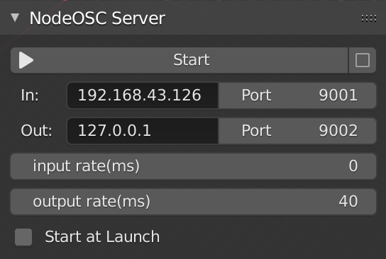
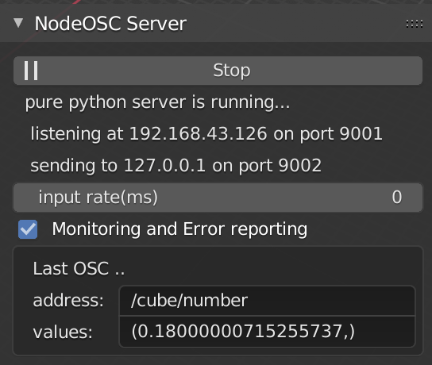
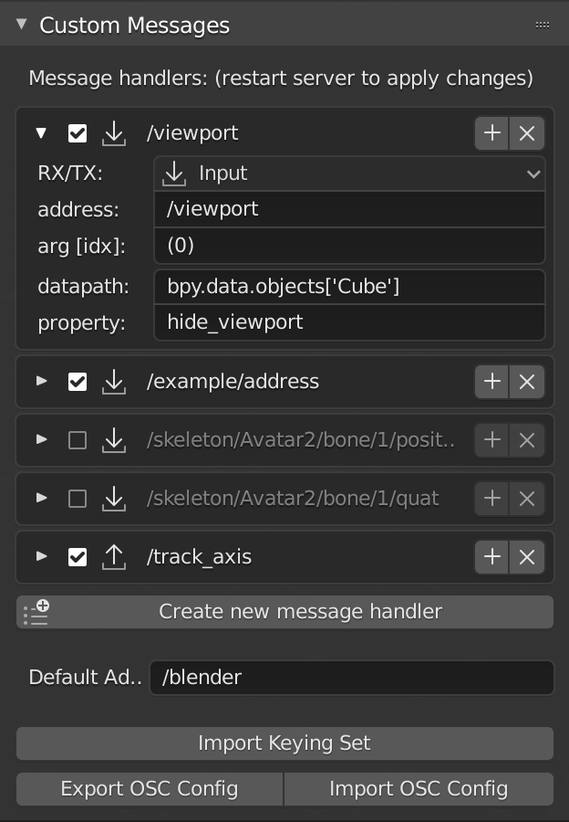
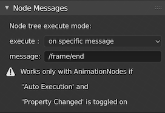
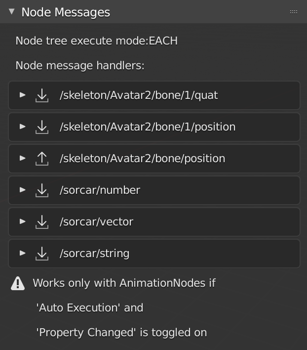
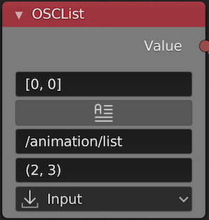
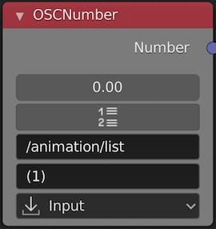
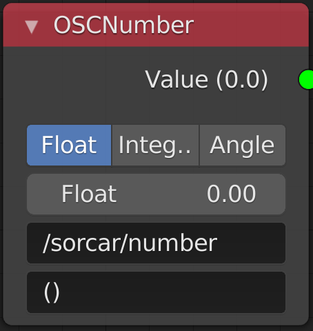
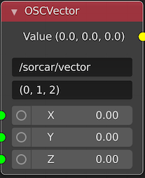
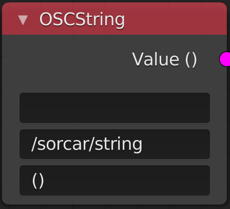

# NodeOSC
OSC support for nodes and general usage.

## Usage
I think it is now fairly self explanatory. However, if you have questions please make an issue. This helps me to see where I should focus on the docs...

* **Start:** Run the OSC server
* **PyLiblio:** alternative to the pure python server there is the pyliblo c-based OSC server. shows better performance on heavy loads. Only available for Windows and OSX (yet).
* **In:** IP address this OSC server is listening on. Only use 127.0.0.1 if your sender runs on the same machine as blender.
* **Out:** IP address this OSC server is sending the OSC messages to. Only use 127.0.0.1 if your receiver runs on the same machine as blender.
* **Port:** Port numbers for listening (In) and sending (Out)
* **input rate [ms]:** the rate the listening server is working through the incoming message queue. 0 = as fast as possible.
* **output rate [ms]:** the rate the sending server is sending outbound messages.
* **Start at Launch:** starts the server when this blender file is loaded. This works only when you save this blender file while the server is NOT running.

---

* **Monitoring and Error reporting:** If errors occur while receiving OSC messages, they will only show if this is toggled on. Use only for debugging, this is a resource intensive functionality.
* **Last OSC message:** Shows not mapped OSC messages. Only the pure python server shows the last OSC message.

---

Shows the list of the custom OSC handlers. An OSC handler defines what should happen if an OSC message arrives.
A normal OSC message may look like this:

`/custom/osc/message 4 myTexVvalue 5.63 1`

with the structure

`address arg0 arg1 arg2 arg3 ...`

where in the above example

* _address_ = /custom/osc/message
* _arg0_ = 4
* _arg1_ = 'myTextValue'
* _arg2_ = 5.63
* _arg3_ = 1

---

**All changes of the OSC handlers will only be applied once the server has been restarted. (This also is true for nodes..)**

---
* **enable:** enables/disable the use of this handler
* **+:** copies this handler
* **x:** deletes this handler
* **RT/X:** Direction of message. You can choose between  
  * INPUT: only listening to OSC messages with the specified address
  * OUTPUT: only sending OSC messages of the specified address.
  * BOTH: sending and listening.
* **address:** OSC address
* **arg[idx]:** message argument indices define which arguments should be passed on.
  * `()` all arguments are passed on
  * `(0)` only arg0  is passed on
  * `(0, 1, 2)` arg0, arg1 and arg2 are passed on
  * `(3, 0, 1, 2)` reordering the arguments to `arg3 arg0 arg1 arg2`
* **datapath:** the blender datapath to the property you want to change
* **property:** the property that needs to be changed
* **Create new message handler** does as it says.
* **Default address** Default address when importing handlers fomr Keying NodeSettings_Run
* **Export OSC config** Exports the custom OSC handlers for using in another file
* **Import OSC config** Imports OSC handlers for using in this file

---

* **execute:** indicates when the node trees should be updated:
  * _on each message:_ updates whenever a new message arrives
  * _on specific message:_ updates only once the specified message arrives
* **message:** specific message that triggers tree update
* `VERY IMPORTANT: read the exclamation info`

---

This list is generated when the server is started. It shows all OSC handlers that are created by nodes. No value can be edited, this needs to be done directly on the node.

---

## Animation Nodes

OSCList is a general use node and can handle all sort of messages.

* **default:** default value needs to be inserted like a list:
  * `[0, 0]` or
  * `['undefined']` or
  * `[1, 'text', 'moretext']`
* **make string:** transforms the incoming message into a string.
* **address:** OSC address
* **arg[idx]:** message argument indices define which arguments should be passed on.
  * `()` all arguments are passed on
  * `(0)` only arg0  is passed on
  * `(0, 1, 2)` arg0, arg1 and arg2 are passed on
  * `(3, 0, 1, 2)` reordering the arguments to `arg3 arg0 arg1 arg2`
* **direction:** message direction
  * INPUT: only listening to OSC messages with the specified address
  * OUTPUT: only sending OSC messages of the specified address.

---

 

 OSCNumber is a general use node for numbers and can pass on single values or lists.

* **default:** default value needs to be inserted
   * either like a list:
      * `[0, 0]` or
      * `['undefined']` or
      * `[1, 'text', 'moretext']`
   * or as a float, depending on the next value:
* **make list:** transforms the incoming message into a list.
* **address:** OSC address
* **arg[idx]:** message argument indices define which arguments should be passed on.
   * `()` all arguments are passed on
   * `(0)` only arg0  is passed on
   * `(0, 1, 2)` arg0, arg1 and arg2 are passed on
   * `(3, 0, 1, 2)` reordering the arguments to `arg3 arg0 arg1 arg2`
* **direction:** message direction
   * INPUT: only listening to OSC messages with the specified address
   * OUTPUT: only sending OSC messages of the specified address.

---

## Sorcar Nodes

  OSCNumber is a general use node for numbers and can pass on single values as floats, ints or angles.

* **choose type:** select which value type to use
* **default:** default value
* **address:** OSC address
* **arg[idx]:** message argument indices define which arguments should be passed on.
  * `()` all arguments are passed on, but only the first is used.
  * `(1)` only arg1 is passed on

---

OSCVector creates Vectors from a list of arguments

* **address:** OSC address
* **arg[idx]:** message argument indices define which arguments should be passed on.
  * `()` all arguments are passed on
  * `(0)` only arg0  is passed on
  * `(0, 1, 2)` arg0, arg1 and arg2 are passed on
  * `(3, 0, 1, 2)` reordering the arguments to `arg3 arg0 arg1 arg2`
* **X:** default value for x
* **Y:** default value for Y
* **Z:** default value for z

---

OSCVector creates strings.

* **default:** default value
* **address:** OSC address
* **arg[idx]:** message argument indices define which arguments should be passed on.
  * `()` all arguments are passed on
  * `(0)` only arg0  is passed on

see the [wiki](https://github.com/maybites/blender.NodeOSC/wiki) for more info (to come...)

## Credits

written by maybites (2020)

inspired by and code used from http://www.jpfep.net/pages/addosc/.

NodeOSC relies on

* the pure [python module](https://pypi.python.org/pypi/python-osc/) [python-osc](https://github.com/attwad/python-osc) (by Attwad).
* the [pyliblo wrapper](http://das.nasophon.de/pyliblo/) for [liblo](http://liblo.sourceforge.net/) OSC library.

the addon contains the compiled pyliblo wrapper for windows and OSX, but not for linux.
